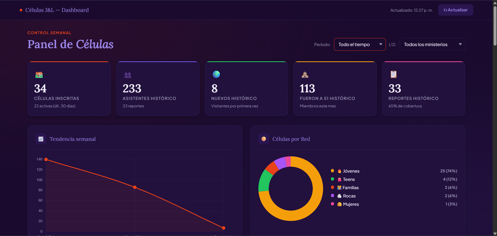
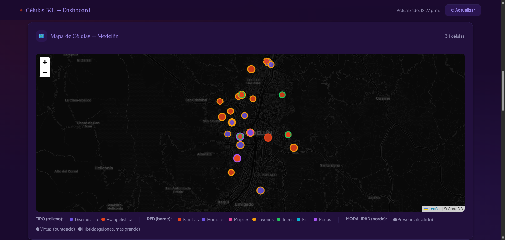

# Células J&L — Cell Group Management System

A full-stack web application for managing small group cells across a large nonprofit 
organization in Medellín, Colombia. Includes a protected analytics dashboard for 
leadership and a public weekly reporting form for cell leaders.

Live data · Authenticated dashboard · Serverless backend · Pure HTML, CSS & JavaScript

---

## Screenshots

**Cell Panel — KPI Overview**


**Interactive Map — Geolocated Cells across Medellín**


---

## Features

### Dashboard (Leadership — Password Protected)
- **Authenticated login** — access controlled via Google Apps Script backend
- **Interactive map of Medellín** with all cells geolocated
  - Color by network (Familias, Hombres, Mujeres, Jóvenes, Teens, Kids, Rocas)
  - Fill by type (Discipulado / Evangelística)
  - Border style by modality (Presencial / Virtual / Híbrida)
- **KPI cards:** total cells, historical attendance, new visitors, S1 members, report coverage
- **Weekly attendance trend** chart
- **Cells by network** donut chart
- **Global filters** by period and ministry
- **Report table** with 5 cross-filters
- **Prayer request feed**

### Public Form (Cell Leaders)
- One-time cell registration form
- Weekly report submission
- Interactive chips for attendance input
- Progress bar through form steps
- Success modal confirmation
- Leaders loaded dynamically from backend
- Serverless — no server required

---

## Tech Stack

| Layer | Technology |
|---|---|
| Frontend | HTML5, CSS3, Vanilla JavaScript |
| Maps | Leaflet.js + CartoDB tiles |
| Charts | Chart.js |
| Data source | Google Sheets API v4 |
| Backend | Google Apps Script (serverless) |
| Auth | Custom login via Apps Script |
| Deployment | Static — runs in any browser |

---

## Architecture
```
Google Sheets (data) ←→ Apps Script (backend/auth) ←→ Browser (HTML/JS)
                                                            ├── Dashboard (protected)
                                                            └── Report Form (public)
```

No server, no database, no hosting costs. The entire backend runs on Google's 
infrastructure for free.

---

## Delivered To

Real client — **Células J&L**, Medellín, Colombia  
A nonprofit organization managing 34 cell groups across multiple networks and ministries.

---

## Other Projects

| Project | Stack | Description |
|---|---|---|
| [MCI Consolidation Dashboard](https://github.com/juandacd/mci-dashboard) | JS · Google Sheets API | Multi-year membership analytics dashboard |
| [Ekonomodo Business Dashboards](https://github.com/juandacd/Ekmd_proyectos) | Python · Streamlit · Google Sheets | Real-time production & logistics control |

---

Built by [Juan David C.](https://www.fiverr.com/juandacd) · Available for freelance work on Fiverr
